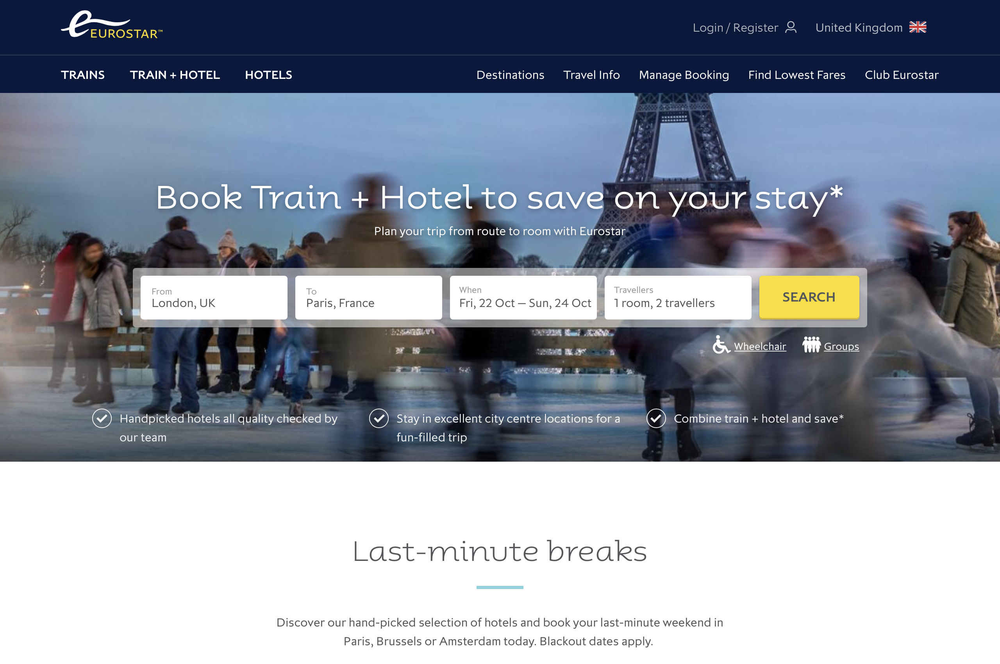
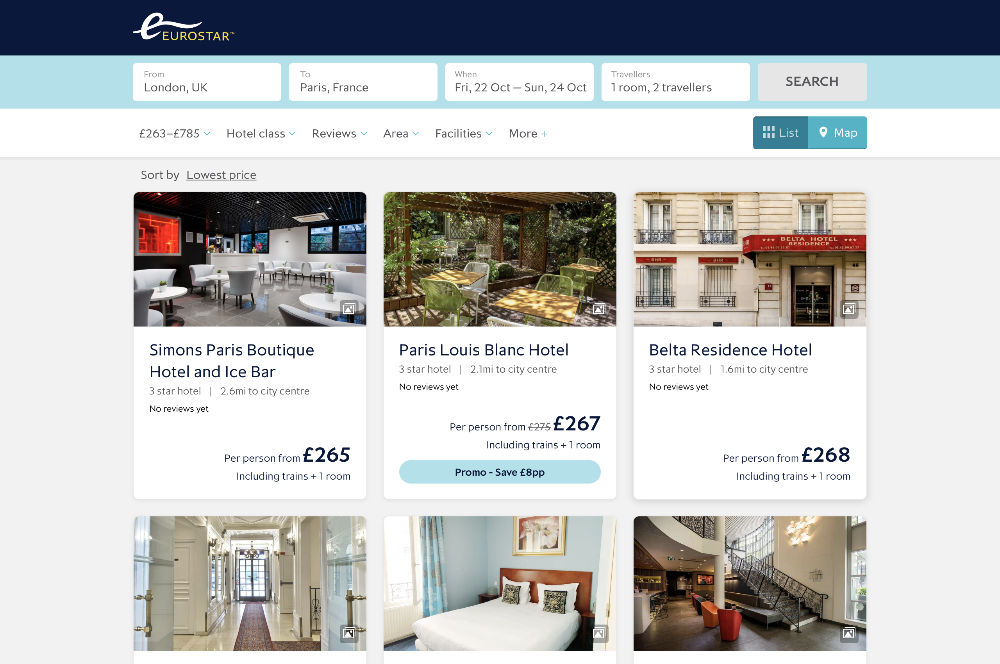
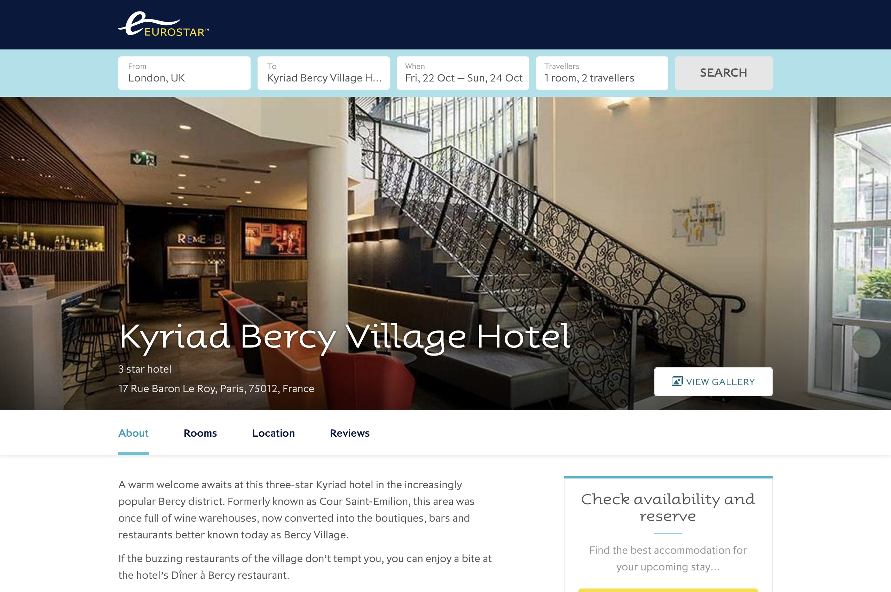
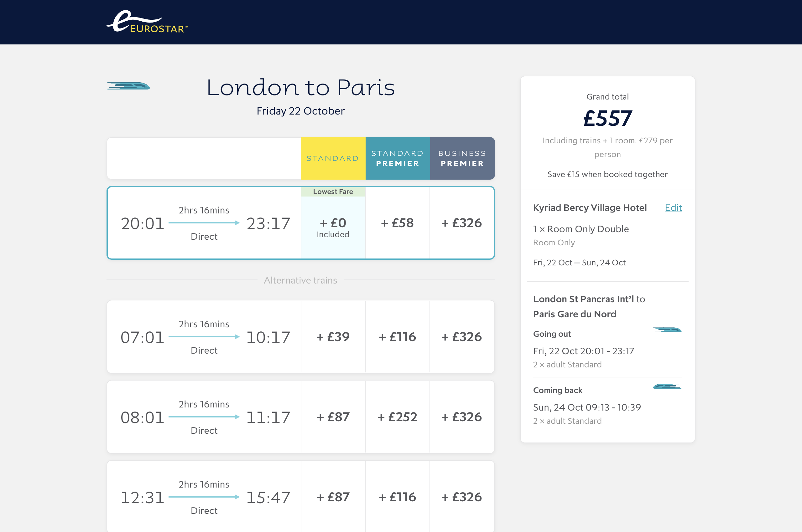
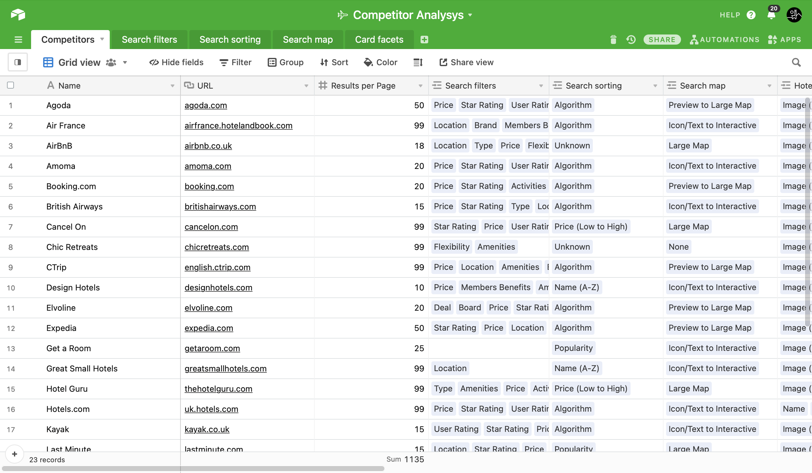
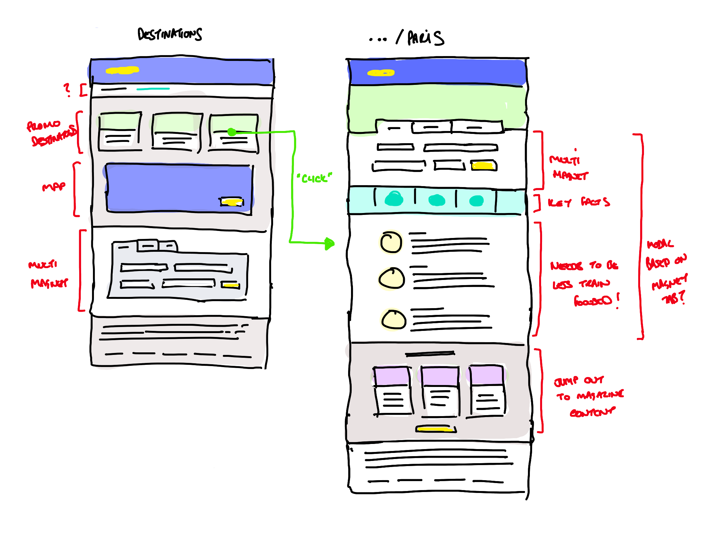
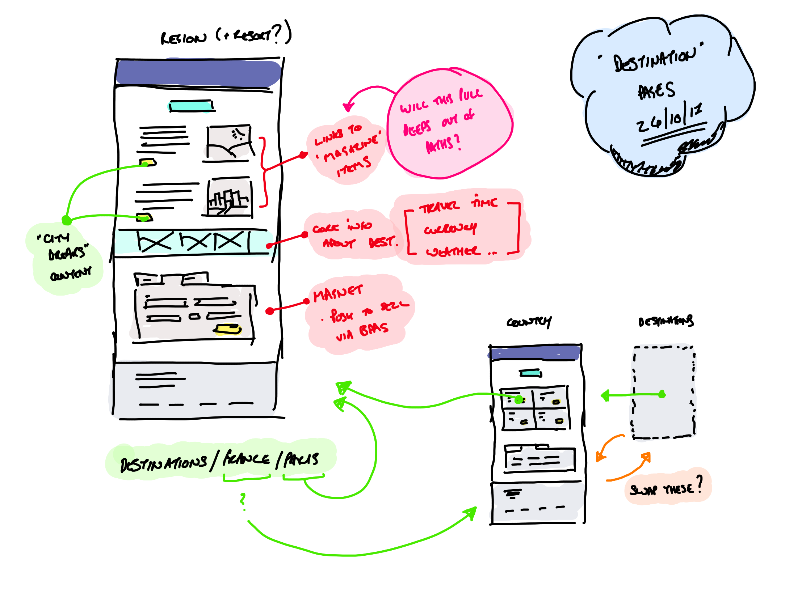

---

title: Designing Eurostar's new package holiday booking platform
slug: package-holiday-booking-platform
summary: In 2018 I helped Eurostar launch a successful replacement for Expedia in just six months.

date: 2019-05-01T12:00:00+01:00

---

[Eurostar][1] operate high-speed trains between the <abbr title="United Kingdom">UK</abbr> and Northern Europe through the channel tunnel. In 2018 I helped them reposition themselves as trusted experts in travel to Northern Europe by designing their new [Train + Hotel][2] package booking platform, offering a range of selected hotels, train journeys, experiences, insurance and more at a discounted price.

<figure>
  <ul node-count="4">
    <li>
      <picture>
        
      </picture>
    </li>
    <li>
      <picture>
        
      </picture>
    </li>
    <li>
      <picture>
        
      </picture>
    </li>
    <li>
      <picture>
        
      </picture>
    </li>
  </ul>
  <figcaption>
    Figure 1 of 3: The Eurostar Train + Hotel platform approximately one year after launch. Select your journey, pick a hotel, choose a room and then choose your train time.
  </figcaption>
</figure>

## The challenge

Before 2018, Eurostar used a co-branded platform run by Expedia to up-sell hotel rooms to customers after they bought a train journey on the Eurostar website. Eurostar wanted ownership over the customer experience and more control over the products they offered. Their aim was to leverage their position as train travel providers to offer package discounts to customers who bought travel and accommodation together, and increase their ancillary revenue by introducing new product lines. My challenge was to design the platform that would allow them to do this and get it live in just six months.

## My role

I was the lead designer in a squad that also included junior designers, developers and a business analyst. The scope of the project and the priorities for this team were jointly defined by myself and the product manager, with input from other stakeholders in Eurostar.

<figure>
  <ul node-count="1">
    <li>
      <picture>
        
      </picture>
    </li>
  </ul>
  <figcaption>
    Figure 2 of 3: Desk research was the main way of understanding the market and defining scope ahead of a tight deadline, This competitor analysis was invaluable in helping us prioritising features.
  </figcaption>
</figure>

I ran the discovery process and all user research. I also defined the information architecture, content and <abbr title="Search Engine Optimisation">SEO</abbr> strategies for incorporating the new platform into the existing Eurostar website.

<figure>
<ul node-count="2">
  <li>
    <picture>
      
    </picture>
  </li>
  <li>
    <picture>
      
    </picture>
  </li>
</ul>
<figcaption>
  Figure 3 of 3: Sketches from a meeting with the content & SEO teams to understand how the existing site architecture might be adapted to incorporate hotel content.
</figcaption>
</figure>

I lead the design of the platform from the initial sketches to the final visuals, and worked with the design system team to ensure the new platform aligned with and contributed to the existing component library.

## The result

The new service was launched on time and within budget. Although basic, it had everything that Eurostar's customers needed to book a new Train + Hotel package. Over the next year we could then iterate on the product to increase conversion, improve the user experience and incorporate more complex functionality like customer reviews and ancillary products.

In the first twelve months, Eurostar's Train + Hotel platform achieved more than 30,000,000<abbr title="Great British Pounds">GBP</abbr> in revenue and sold packages to over 100,000 customers. Sales of hotels increased by 47% and new package customers grew by 89% compared to the previous Expedia-powered platform.

[1]: https://www.eurostar.com
[2]: https://www.eurostar.com/rw-en/packages