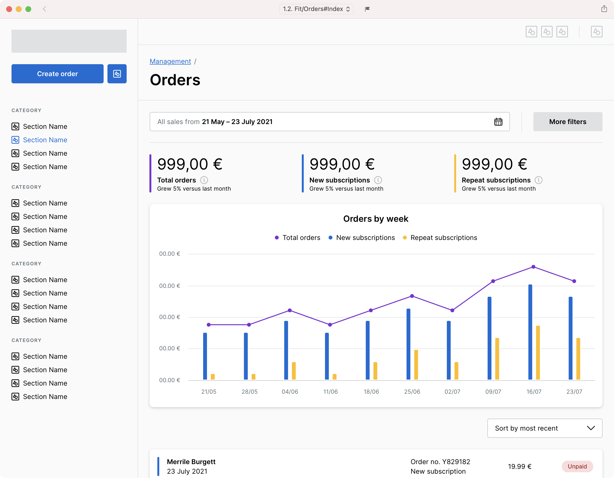
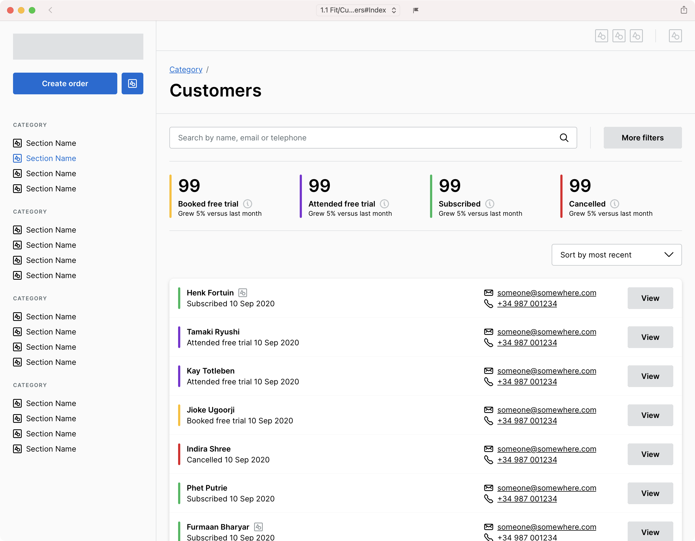
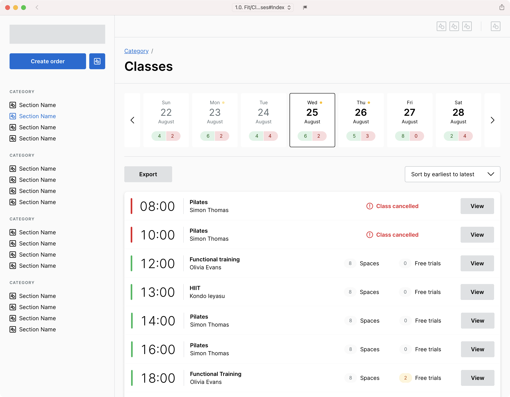
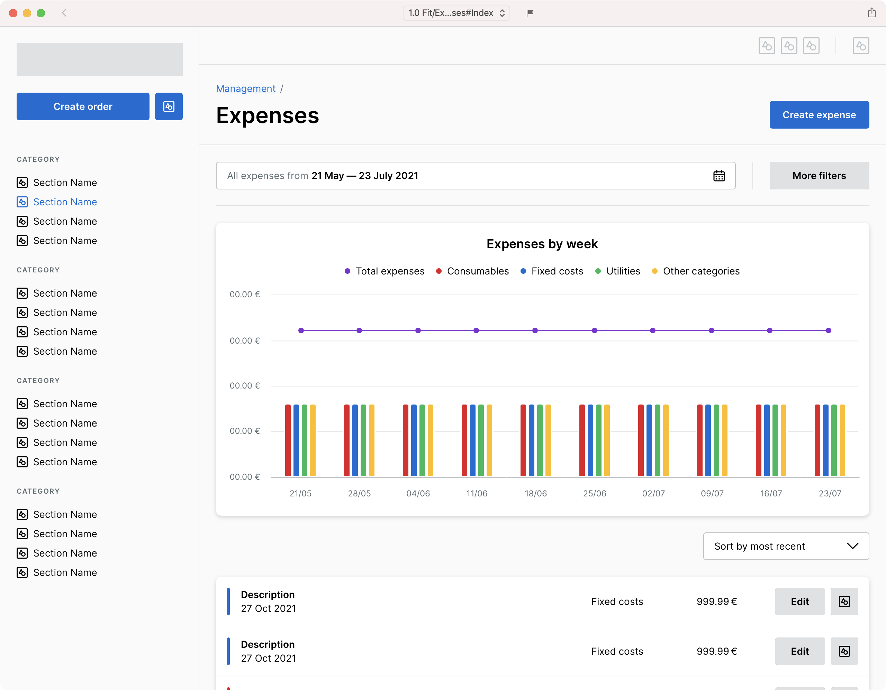
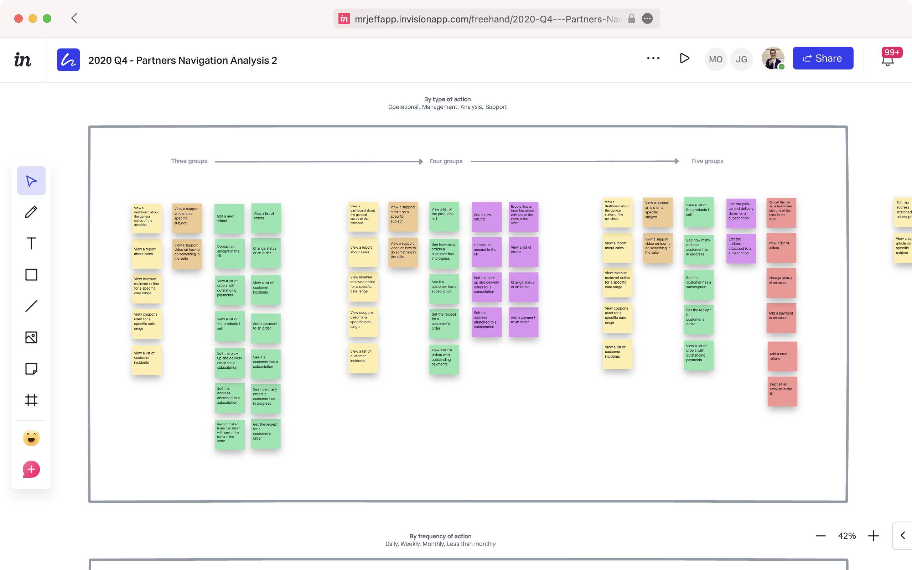
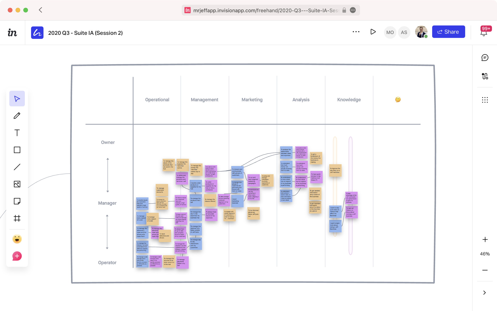
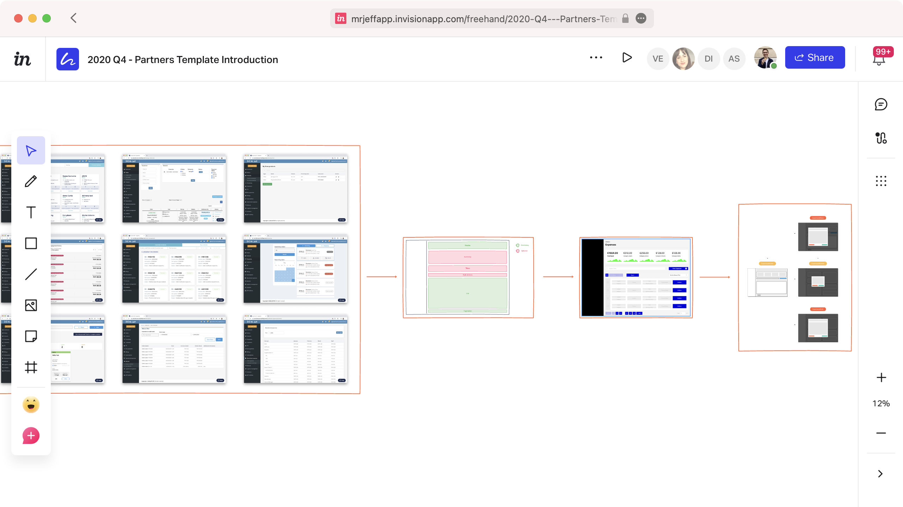

---

title: Creating the UX strategy that unified the design of Jeff's various platforms.
slug: unifying-multiple-platforms
summary: In 2020, I helped Jeff bring consistency to how they design and develop their software.

date: 2020-09-30T12:00:00+01:00
draft: false
  
---

[Jeff][1], based in Valencia, Spain, operates franchises globally across a number of business verticals, such as laundry, co-working spaces, fitness studios and beauty salons. This includes providing software used by the franchisees to manage and grow their businesses. In 2020 I developed the UX strategy that Jeff would use to create a consistent user experience for franchisees across all of their verticals.

<figure>
<ul node-count="4">
  <li>
    <picture>
      
    </picture>
  </li>
  <li>
    <picture>
      
    </picture>
  </li>
  <li>
    <picture>
      
    </picture>
  </li>
  <li>
    <picture>
      
    </picture>
</li>
</ul>
<figcaption>
  Figure 1 of 3: Examples of the new navigation and template systems I developed in use across various business functions and verticals.
</figcaption>
</figure>

## The challenge

Jeff began with laundry franchises, and has since developed or acquired numerous additional verticals over the past five years. Each vertical had its own software platform for franchisees to manage their business, each utilising different technology stacks and different designs. There was no consistency in how each vertical solved the same problems and some verticals were missing key functionality. My challenge was to develop a plan for aligning the design of the software regardless of vertical and to help Jeff consolidate the feature set and streamline future development.

## My role

I was responsible for defining the strategy, reporting to the Head of Design and the CTO. I was also responsible for ensuring the various squads across each vertical followed the strategy, working with the product managers and designers on how best to implement my work as they developed new features.

## The result

I delivered a strategy based around a new information architecture and navigation system that aligned the platforms around the common jobs performed across the verticals. This is already helping the squads to better prioritise their work based not just on the impact to their own vertical but also to all Jeff franchisees.

<figure>
  <ul node-count="2">
    <li>
      <picture>
        
      </picture>
    </li>
    <li>
      <picture>
        
      </picture>
    </li>
  </ul>
  <figcaption>
    Figure 2 of 3: Analysis sessions run with franchisees and stakeholders to define the new information architecture
  </figcaption>
</figure>

The new information architecture was paired with a new content model that aligns the business objects and terminology used across Jeff. This has helped all levels of the business to communicate better internally and externally, and allowed the squads to develop functionality that works across the different business models.

<figure>
  <ul node-count="1">
    <li>
      <picture>
        
      </picture>
    </li>
  </ul>
  <figcaption>
    Figure 3 of 3: Analysis of the common features within the different software platforms and how templates could be used to replace them.
  </figcaption>
</figure>

A new template system for common user flows added a layer of consistency on top of the developing design system. The majority of features launched on the platform today use this template system, increasing the speed at which the squads can deploy and test new features and introducing a consistency to the user experience that was previously missing.

[1]: https://jeff.com
