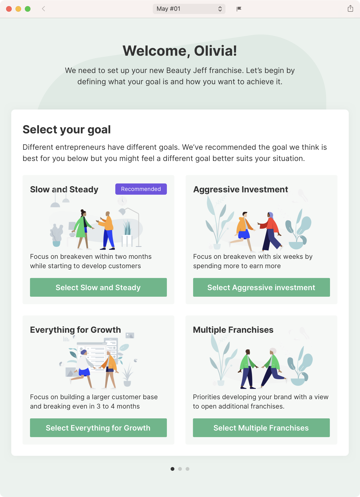
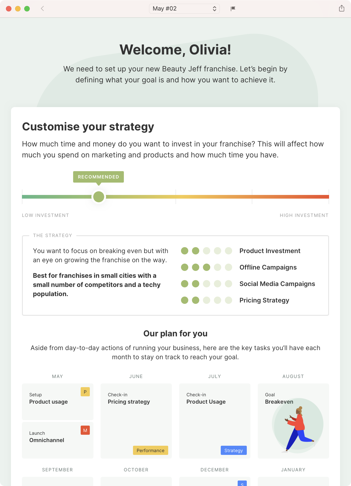
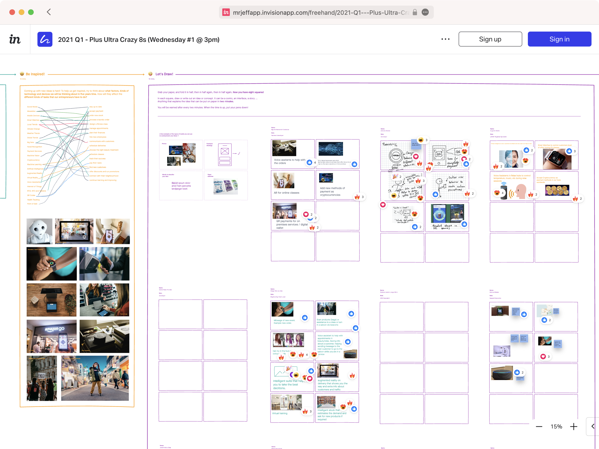
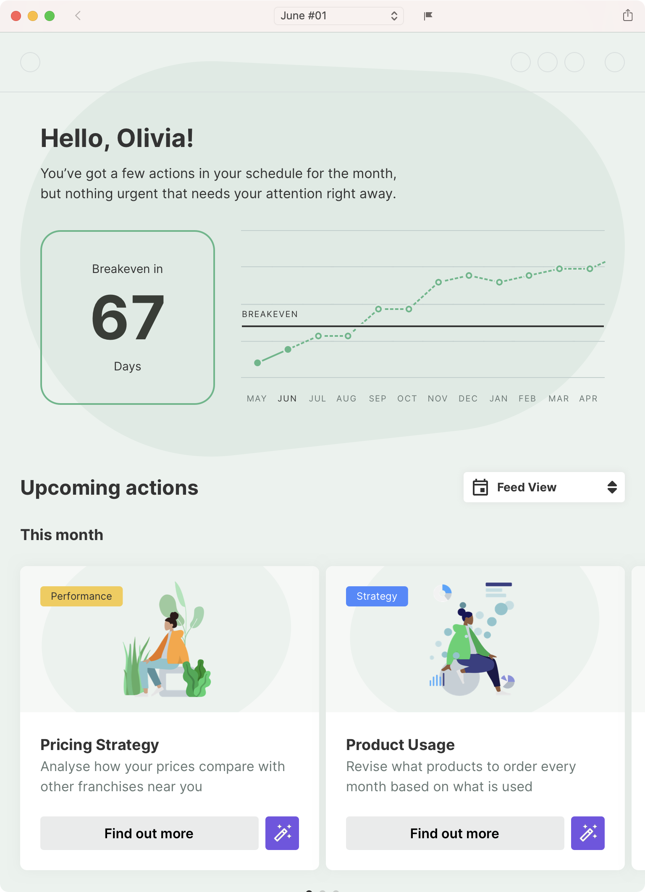
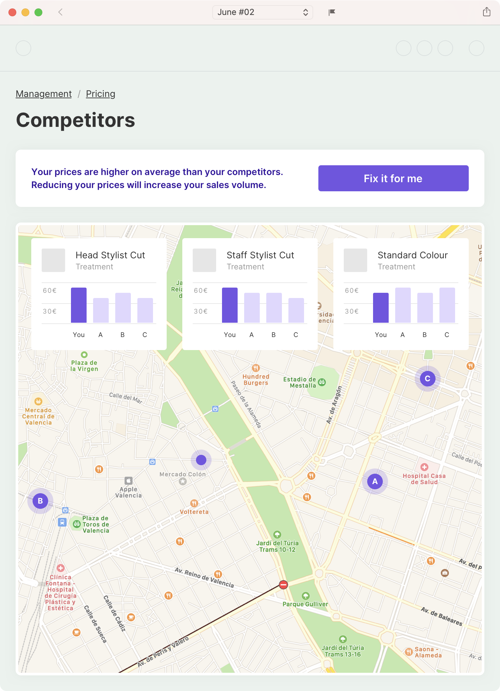
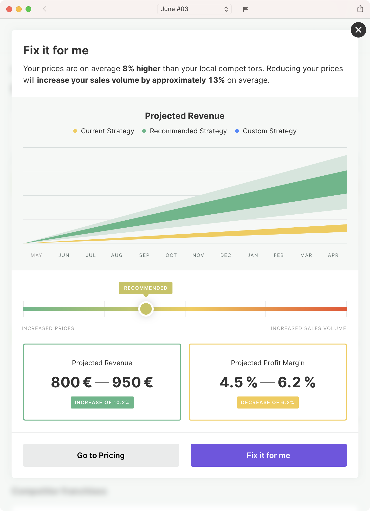

---

title: Defining the future of Jeff's business management software
slug: future-of-jeffs-software
summary: In 2021 I delivered a vision project that set the future direction for Jeff's growing franchise business.

date: 2021-05-31T12:00:00+01:00
draft: false
  
---

[Jeff][1], based in Valencia, Spain, operates franchises globally across a number of business verticals, such as laundry, co-working spaces, fitness studios and beauty salons. This includes providing software used by the franchisees to manage and grow their businesses. In 2021 I led the project that would define what their strategy for that software would be over the next five years.

<figure>
  <ul node-count="2">
    <li>
      <picture>
        
      </picture>
    </li>
    <li>
      <picture>
        
      </picture>
    </li>
  </ul>
  <figcaption>
    Figure 1 of 3: Onboarding a new partner to the future platform, introducing the importance of setting a strategy based on their own goals for their business.
  </figcaption>
</figure>

## The challenge

Jeff began with laundry franchises, and has since developed or acquired numerous additional verticals over the past five years. This organic growth had led to their software being too heavily focused on how to run a franchise in each individual vertical. There was no alignment across the verticals and the software did not leverage the growing expertise Jeff had in running small businesses or use that expertise intelligently to help businesses improve their performance. My challenge was to define how Jeff's franchisee software could be smarter, more intelligent and help their users be more successful across all of Jeff's current and future verticals.

## My role

I was responsible for setting the direction of the project based on input from senior stakeholders at Jeff and delivering the strategy to the business so that it would resonate throughout the company and wouldn't be forgotten in six months time.

<figure>
  <ul node-count="1">
    <li>
      <picture>
        
      </picture>
    </li>
  </ul>
  <figcaption>
    Figure 2 of 3: One of many Crazy-8s workshops run with stakeholders at all levels of Jeff, introducing the project and getting inspiration for the future of the product.
  </figcaption>
</figure>

I designed and facilitated discovery sessions, design sprints and workshops with staff involved at every level of the business, from technical support to heads of verticals and the senior leadership team.

<figure>
  <ul node-count="3">
    <li>
      <picture>
        
      </picture>
    </li>
    <li>
      <picture>
        
      </picture>
    </li>
    <li>
    <picture>
      
    </picture>
  </li>
  </ul>
  <figcaption>
    Figure 3 of 3: Using the "Fix it for me" mechanic to define a better, more effective pricing strategy for the franchisee's business.
  </figcaption>
</figure>

With the help of a junior product designer, I created low and high-fidelity concepts and prototypes showing the different functionality the software might provide in the future, and updated Jeff's product principles to ensure the entire company aligned with the updated strategy.

## The result

In May 2021 I presented a prototype to the senior leadership team at Jeff that defined a proactive approach to helping partners define their goals and strategically grow their business. It was centred around a "Fix it for me" concept that illustrated how Jeff's users could effortlessly and confidently solve complex problems, such as how to price their products, using the intelligence Jeff has from running thousands of franchises around the world.

The project was well received and fully bought into by all levels of the organisation, acting as a source of inspiration not only for the teams working directly with franchisees but also in other areas of the business. The leadership team have also used it as part of their pitch for investment and to build new partnerships.

In the six months since the end of the project, many of the new features launched by Jeff have used this project as a starting point. The "Fix it for me" concept has already been incorporated into the software as a way to help business owners intelligently target customer segments in marketing campaigns.

[1]: https://jeff.com
